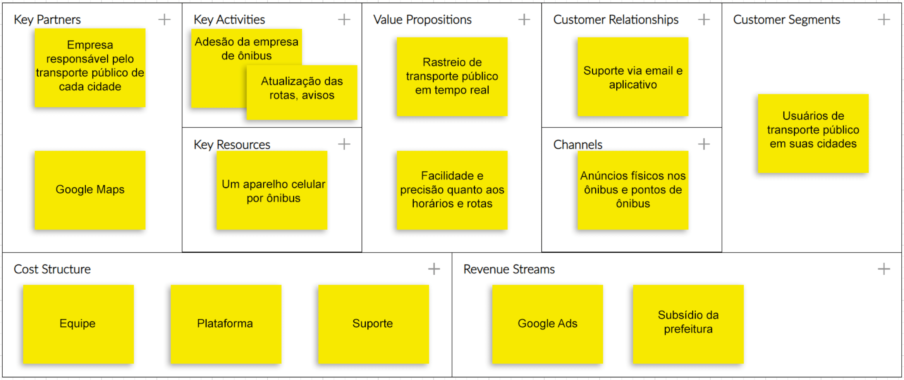
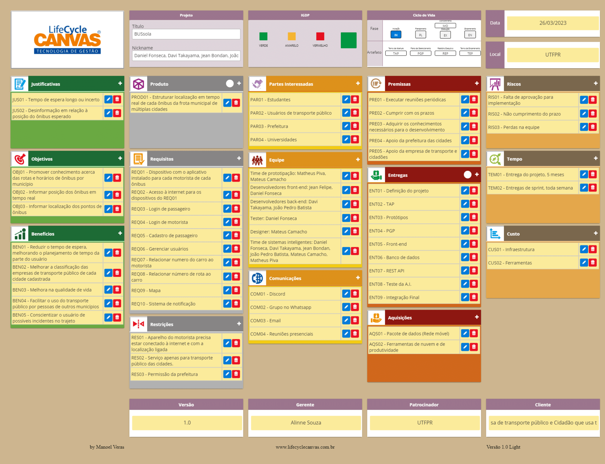
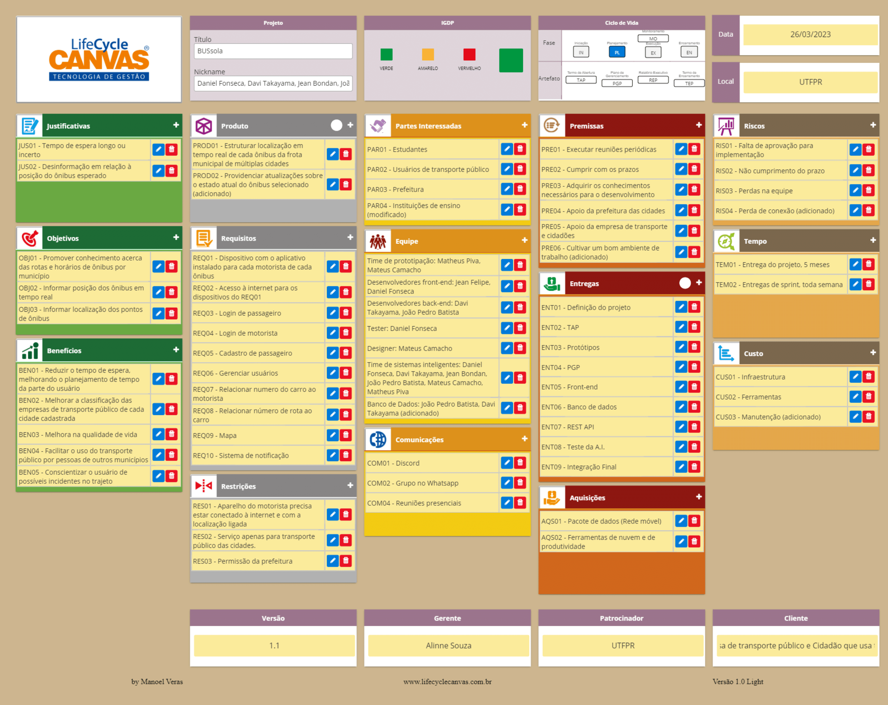

# 
BUSsola

> ## Desenvolvedores:
> ---
> Daniel Fonseca da Silva 2315807; 
> Davi Gil Brito Vaz Takayama 2316374; 
> Jean Felipe Camaroto Bondan 2272555; 
> João Pedro dos Santos Batista 2272563; 
> Matheus dos Santos Piva 2272644. 
> Mateus Dias Camacho 2315866

> ## Papéis (principal, secundário):
> ---
> **Prototipação:** 
> Matheus Piva, Mateus Camacho;
>
> **Front-end:** 
> Jean Felipe, Daniel Fonseca;
>
> **Back-end:** 
> Davi Takayama, João Pedro;
>
> **Testes:** 
> Daniel Fonseca;
>
> **Design:** 
> Mateus Camacho;

> ## Aluno por disciplina:
> ---
> **Fundamentos de sistemas inteligentes:** 
> - Todos;
>
> **Gestão de projeto de software:** 
> - Todos;
>
> **Programação para dispositivos móveis:** 
> - Daniel Fonseca da Silva 2315807; 
> - Davi Gil Brito Vaz Takayama 2316374; 
> - Jean Felipe Camaroto Bondan 2272555; 
> - João Pedro dos Santos Batista 2272563; 
> - Matheus dos Santos Piva 2272644.
>
> **Verificação e validação:** 
> - Todos

> ## Descrição do projeto:
> ---
> BUSsola é um aplicativo mobile focado em exibir a localização em tempo real do transporte público das cidades registradas, começando pela cidade de Dois Vizinhos Paraná, desenvolvido por alunos da UTFPR da cidade em questão

> ## Tecnologias/ferramentas:
> **Front-mobile:** React-Native com typescript; 
> **Back-end:** Nest.Js; 
> **A.I.:** Python; 
> **Banco de dados:** PGadminV4 com SQL postgres; 
> **Test:** React-Tests.

> ## Links:
> ---
> **Repositório do projeto:** [GitHub](https://github.com/Daniel-Fonseca-S/BUSsola)
>
> **Protótipo:** [Figma](https://www.figma.com/file/1n5wHLMO3cJufld3VP7JZX/BUSSOLA?node-id=0%3A1&t=WkQ0PqyqWs0Fw6zG-1)
>

> ## Artefatos:
> ---
> **Canvas:** 
> 

>
> **TAP:** 
> 

>
> **PGP:** 
> 

